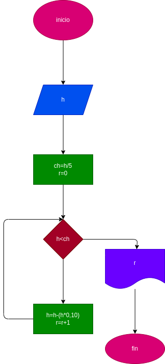

# una pelota se deja caer desde una altura h, y en cada rebote sube el 10% menos del anterior hacer el diagrama de flujo y el programa que lea h, y que calcule e imprima en cual rebote la pelota no alcanza a subir la quinta parte de la altura inicial
## Diagrama de flujo
